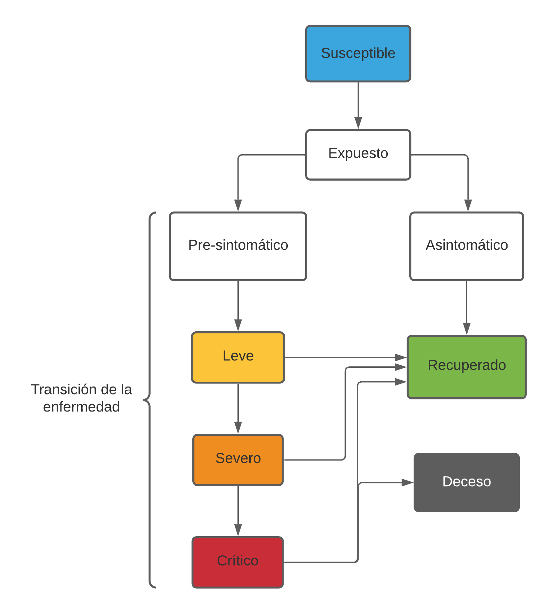

# simulador_COVID_19
Prueba porque la cagué en la otra

En este proyecto se realizó un simulador del comportamiento de contagios por la enfermedad Covid-19.
Si sólo doy un salto de línea se queda en la misma igual, le vale nepe a la madre esta.

Ahora voy a intentar subir una imágen.

Mamó...

Ahí va de nuevo:

Voy a probar con un diagrama de flujo :)

Soy perro.

Ahora van las tablas :(

| Primer encabezado | Segundo encabezado |
| ------------- | ------------- |
| Contenido de la celda  | Contenido de la celda  |
| Contenido de la celda  | Contenido de la celda  |

# Tablas
Voy a subir una de las perras:

MEMORIA DEL AGENTE:

| NOMBRE | SIGNIFICADO | TIPO DE VARIABLE |
| ------------- | ------------- |------------- |
| TE | Tiempo de Enfermedad | Numérico entero |
| TI | Tiempo de inmunidad | Numérico entero |
| evRec | Evento aleatorio para recuperación | Numérico flotante |
| evInf | Evento aleatorio para infección | Numérico flotante |

Va el resto :)

PROPIEDADES DEL AGENTE

| NOMBRE | SIGNIFICADO | TIPO DE VARIABLE |
| ------------- | ------------- |------------- |
| Infectado | Agente con enfermedad Covid-19 | Booleano |
| Inmunidad | Agente recuperado y con inmunidad a Covid-19 | Booleano |
| Asintomático | Agente con estado infectado que pasa a Inmunidad | Booleano |
| Vivo | Agente con estado vivo | Booleano |
| COM | Comorbilidades: estado que influye en probabilidad de recuperación | Booleano |
| Vacunado | Estado que influye en la probabilidad de infección del agente | Booleano |
| msnInf | Mensaje de infección recibido al entrar en el radio de acción de otro agente | Booleano |
| x | Posición en eje x | Numérico flotante |
| y | Posición en eje y | Numérico flotante |

PROPIEDADES DEL SIMULADOR

| NOMBRE | SIGNIFICADO | TIPO DE VARIABLE |
| ------------- | ------------- |------------- |
| numAg | Número de agentes totales | Numérico entero |
| numInf | Número de agentes infectados | Numérico entero |
| numCOM | Número de agentes con comorbilidades | Numérico entero |
| numVac | Número de agentes vacunados | Numérico entero |
| Días | Número de días de simulación | Numérico entero |
| numAgInf | Número actual de agentes infectados | Numérico entero |
| numAgDec | Número actual de agentes fallecidos | Numérico entero |
| i, k, h | Variables auxiliares para ciclos | Numérico entero |

# Diagramas de Flujo
